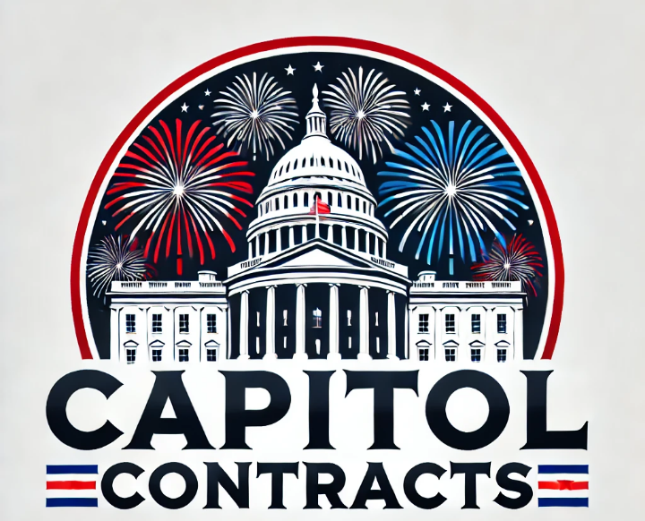

  

# "What Really Happened" (WRH) 75-Session Master Curriculum
## **Performance Work Statement (PWS) for the "What Really Happened" (WRH) Master Curriculum**

### **1.0 Introduction and Background**

This document outlines the Performance Work Statement (PWS) for the "What Really Happened" (WRH) Master Curriculum, a comprehensive psychoeducational intervention designed to enhance behavioral health, recovery, and risk mitigation, with a specialized focus on the veteran population. Developed by Capitol Contracts LLC, a Service-Disabled Veteran-Owned Small Business (SDVOSB), this curriculum addresses critical needs within federal agencies, including the Department of Veterans Affairs (VA), Department of Defense (DoD), Department of Labor (DOL), and the Substance Abuse and Mental Health Services Administration (SAMHSA), by providing a structured, replicable, and evidence-informed program.

### **2.0 Scope of Work**

The Contractor shall provide access to and facilitation support for the 75-Session WRH Master Curriculum, designed as a non-clinical psychoeducational intervention. The scope includes the delivery of a structured program focused on System Logic Translation, which reframes trauma responses as predictable engineering problems rather than character flaws. This approach aims to foster resilience, improve adaptive coping mechanisms, and mitigate risk factors among participants, particularly veterans.

### **3.0 Performance Requirements**

#### **3.1 Program Overview**

The **75-Session Master Curriculum** is a proprietary, non-clinical psychoeducational intervention designed by **Capitol Contracts LLC**. It is a structured, replicable program for behavioral health, recovery, and risk mitigation, with a heavy emphasis on veterans. 

This curriculum frames trauma recovery as **System Logic Translation**—treating trauma responses as predictable engineering problems (mechanical loops, wiring patterns, and interruptible biological programs) rather than character flaws or emotional vulnerabilities.

#### **3.2 Core Components and Deliverables**

The Contractor shall deliver a unified program integrating the following core components into a sequential 75-session flow:

1.  **Part I: The System Logic Map (Sessions 1–26)**: Provides foundational understanding of physiological adaptations of the nervous system, based on the *26 Laws of Survival*. (Deliverable: Comprehensive understanding of System Logic Map principles).
2.  **Part II: The Core Operational Journey (Sessions 27–56)**: Implements the *30-Session Pilot Program*, focusing on mechanical loops, wiring patterns, and biological programs. (Deliverable: Application of core operational strategies for behavioral regulation).
3.  **Part III: Advanced System Specialization (Sessions 57–75)**: Offers the *19-Session Advanced Series*, concentrating on advanced system specialization and institutional failure analysis. (Deliverable: Specialized knowledge and analytical skills for complex system dynamics).
4.  **Part IV: Facilitator Standardization Toolkit**: Equips facilitators with professional tools for standardized delivery, ensuring program fidelity and scalability. (Deliverable: Standardized facilitator resources and protocols).

### **3.3 Tiered Service Offerings and Pricing Structure**

Capitol Contracts LLC offers the WRH Master Curriculum through a tiered service model, designed to meet diverse agency requirements and budget allocations. This structure facilitates modular procurement and scalability for federal and institutional buyers (e.g., VA, DoD, DOL, SAMHSA).

| Service Tier | Sessions | Focus Area | Estimated Price Per Cohort (8–12 Participants) |
| :----------- | :------- | :--------- | :--------------------------------------------- |
| **Foundation** | 26       | System Logic Map & Laws of Survival | $18,500                                        |
| **Core**     | 56       | Core Operational Journey & Pilot Program | $32,000                                        |
| **Master**   | 75       | Full Program & Facilitator Standardization Toolkit | **$48,000**                                    |

*Note: Pricing is an estimate and subject to negotiation based on specific contract requirements, cohort size, and duration. All pricing is firm-fixed-price for the specified scope of work.*

### **4.0 Applicable Documents**

1.  **Statement of Objectives (SOO)**: Outlines the overarching goals and desired outcomes for the WRH Master Curriculum implementation.
2.  **Quality Assurance Surveillance Plan (QASP)**: Details the Government's approach to monitoring the Contractor's performance.
3.  **Data Rights and Intellectual Property (IP) Clause**: Governs the use and protection of proprietary materials.
4.  **Facilitator Standardization Toolkit**: Provides detailed scripts and protocols for program delivery.

### **5.0 Government Furnished Property/Services (GFP/GFS)**

No Government Furnished Property (GFP) or Government Furnished Services (GFS) are anticipated for the execution of this PWS. The Contractor shall be responsible for providing all necessary resources, facilities, and personnel to deliver the WRH Master Curriculum.

### **6.0 Design Principles and Technical Approach**

The WRH Master Curriculum is underpinned by robust design principles that ensure its efficacy, scalability, and compliance with federal program requirements:

*   **6.1 Engineering Framing**: The curriculum employs an engineering-based framework, transitioning from a "vulnerability-first" paradigm to a neutral, technical diagnostic approach. This principle ensures objective analysis of behavioral patterns and promotes a solution-oriented mindset.
*   **6.2 Mechanism Breakdowns**: Each session is meticulously structured to apply system logic, enabling participants to observe behavioral mechanisms, translate underlying loops, and gain control over their responses. This systematic approach facilitates measurable behavioral modification.
*   **6.3 Standardized Facilitator Scripts**: To ensure program fidelity, scalability, and minimize re-traumatization risk, the curriculum includes comprehensive, standardized scripts for non-clinical facilitators. This ensures consistent delivery and adherence to established protocols across all implementations.
*   **6.4 Intellectual Property (IP) Integrity**: All 75 sessions are maintained in their full, original detail, without summarization, to preserve the integrity of the proprietary intellectual property. This ensures that the program's foundational principles and methodologies remain intact and uncompromised.

### **Repository Structure**
The curriculum is organized into parts, with each session as a distinct markdown file containing both the **Lesson Content** and the **Facilitator Script**.

- `Part-I/`: Sessions 1-26 (Laws of Survival)
- `Part-II/`: Sessions 27-56 (Core Operational Journey)
- `Part-III/`: Sessions 57-75 (Advanced Specialization)
- `Part-IV/`: Facilitator Toolkit, Glossary, and Commercial Materials

### **7.0 About Capitol Contracts LLC**

Capitol Contracts LLC is a distinguished Service-Disabled Veteran-Owned Small Business (SDVOSB) dedicated to providing high-quality professional training and psychoeducational support services. Our commitment to excellence and our specialized focus on veteran populations align with federal initiatives to support veteran-owned businesses and enhance the well-being of service members and their families. Our federal contracting identifiers are as follows:

*   **Unique Entity Identifier (UEI)**: HH77KN5AV5X7
*   **Commercial and Government Entity (CAGE) Code**: 9ZFJ6

Capitol Contracts LLC is prepared to meet the stringent requirements of federal contracts, offering a proven track record of delivering impactful and compliant solutions.

---
*Proprietary Intellectual Property of Capitol Contracts LLC. All Rights Reserved.*
